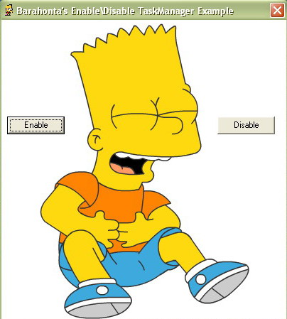



## Barahonta's EnableDisable TaskManager Example

### Description

Barahonta's EnableDisable TaskManager Example lets you disable or enable the task manager as you like....
 
### More Info
 

             |
---                |---
**Submitted On**   |2000-04-30 11:27:06
**By**             |[bArAhOnTa](https://github.com/Planet-Source-Code/PSCIndex/blob/master/ByAuthor/barahonta.md)
**Level**          |Beginner
**User Rating**    |4.0 (16 globes from 4 users)
**Compatibility**  |VB 3\.0, VB 4\.0 \(16\-bit\), VB 4\.0 \(32\-bit\), VB 5\.0, VB 6\.0, VB Script, ASP \(Active Server Pages\) , VBA MS Access, VBA MS Excel
**Category**       |[Miscellaneous](https://github.com/Planet-Source-Code/PSCIndex/blob/master/ByCategory/miscellaneous__1-1.md)
**World**          |[Visual Basic](https://github.com/Planet-Source-Code/PSCIndex/blob/master/ByWorld/visual-basic.md)
**Archive File**   |[Barahonta'1993265112006\.zip](https://github.com/Planet-Source-Code/barahonta-barahonta-s-enabledisable-taskmanager-example__1-65295/archive/master.zip)

